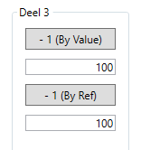

# Labo 5 - Methodes
## Deel 1
De code die wordt uitgevoerd wanneer je op één van de drie knoppen klikt is telkens dezelfde: 
- De waarde van de *totalSumTextBox* wordt opgehaald
- De waarde wordt verhoogt met 1
- De nieuwe waarde wordt terug in de *totalSumTextBox* geplaatst

### Opdracht
- Maak een void methode *AddToTotalSum()* 
- Zorg dat de code die hierboven beschreven staat in deze methode wordt geplaatst
- Roep deze methode aan wanneer er op één van de drie knoppen wordt geklikt

## Deel 2
- Wijzig de tekst van de knoppen als volgt:

	
- Wijzig de *AddToTotalSum()* methode zodat een geheel getal kan worden meegegeven als parameter
- Pas de code aan zodat de methode *AddToTotalSum()* wordt aangeroepen met de waarde van de knoppen als argument

## Deel 3
- Kopieer onderstaande XAML code en plak het als inhoud van het *secondPanel*
```
    <Button Content="- 1 (By Value)" Height="24" Width="100" Margin="10" Name="subtractByValButton" Click="subtractByValButton_Click"/>
    <TextBox Name="resultByValTextBox" Text="100" Margin="10 0" TextAlignment="Right"/>
    <Button Content="- 1 (By Ref)" Height="24" Width="100" Margin="10" Name="subtractByRefButton" Click="subtractByRefButton_Click"/>
    <TextBox Name="resultByRefTextBox" Text="100" Margin="10 0" TextAlignment="Right"/>
```
- Kopieer onderstaande code en plak het in de code-behind van de *MainWindow*
```
    private void subtractByValButton_Click(object sender, RoutedEventArgs e)
    {
        // Get the current value from the textbox:
        int currentValue = int.Parse(resultByValTextBox.Text);
        // Pass the value to the subtractByVal method:
        subtractByVal(currentValue);
        // Display the new value in the textbox:
        resultByValTextBox.Text = currentValue.ToString();
    }

    private void subtractByVal(int currentValue)
    {
        // Subtract 1 from the value passed via the parameter:
        currentValue -= 1;
    }

    private void subtractByRefButton_Click(object sender, RoutedEventArgs e)
    {
        // Get the current value from the textbox:
        int currentValue = int.Parse(resultByRefTextBox.Text);
        // Pass the value to the subtractByVal method:
        subtractByRef(ref currentValue);
        // Display the new value in the textbox:
        resultByRefTextBox.Text = currentValue.ToString();
    }

    private void subtractByRef(ref int currentValue)
    {
        // Subtract 1 from the value passed via the parameter:
        currentValue -= 1;
    }
```
- Test de werking van de 2 nieuwe knoppen en beschrijf je bevindingen in commentaar bij de code



## Deel 4
- Maak een nieuwe functie methode met de naam *ValidateInput*
- Zorg voor 2 parameters:
    - Een string *input* die de tekst bevat die zal worden gevalideerd
    - Een string *errorMessage* die de foutboodschap bevat die zal worden getoond als de validatie faalt
- Zorg dat deze methode de waarde *true* retourneert indien de *input* parameter een getal voorstelt tussen 0 en 100
- Maak een event procedure voor het click event van de *validateButton*
- Roep de methode *ValidateInput* aan met de waarde van de *inputTextBox* als argument voor de input parameter
- Toon een *MessageBox* die de *errorMessage* toont, maar enkel indien de methode *ValidateInput* *false* retourneert


